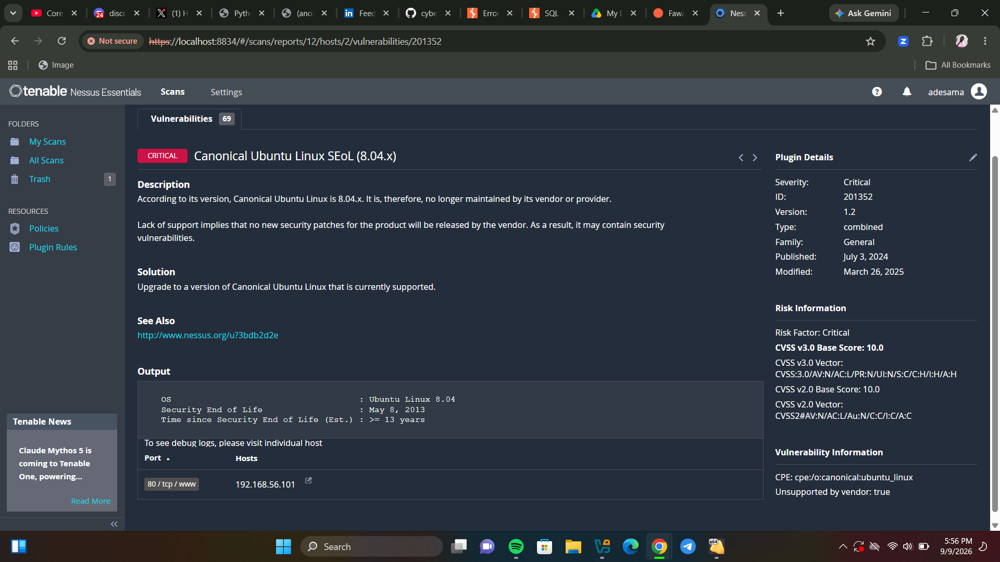
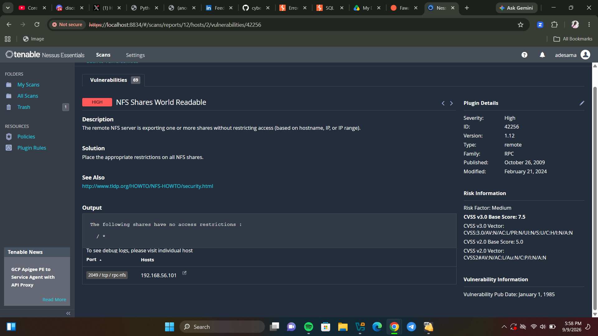

# Vulnerability Assessment Report
## Target: metasploitable 2 (192.168.56.101)

**Date:** September  2026

**Assessor:** Adebare Adeoluwa

**Classification:** Confidential

## Executive Summary
Carried out a vulnerability assessment of a metasploitable machine using nessus essentail basic scan, the results showed a total of 69 vulnerabilities of varying severities. 10 of which are critical and need to be addressed as soon as possible.
These vulnerabilities are easy access for attackers to gain entry into the network or exploit the machine so they need to be addressed either by patching the operating system or upgrading to a better operating system that offers the same service but with fewer vulnerabilities.

## Scope and Methodology
- **Target:** metasploitable 2 - 192.168.56.101
-  **Scan type:** Unauthenticated network vulnerability scan
- **Tools used:** Nessus Essentials
- **Scan duration:** 22 minutes
- **Date of scan:** September 2026

**Methodology:**
i powered on the metasploitable machine and retrieved its ip address, on the nessus essential platform, start a new scan and select basic network scan, a name should be given to the scan for easy identification. the form was completed with the ip address of the target machine.
the scan is then started and after some minutes the results available for study.

---

## Vulnerability Summary
| Severity | Count |
| --- | --- |
| critical | 10 |
| high | 6 |
| medium | 24 |
| low | 9 |
| informational | 139 |
| **Total** | **188** |

--- 

## Detailed Findings
### Finding 1 - canonical ubuntu linux end of life
| field | detail |
| --- | --- |
| severity | critical |
| CVSS score | 10.0 |
| plugin ID | 201352 |
| affected component | operating system (OS) |

**description:** 
the target system is running ubuntu linux 8.04 (hardy heron) which reached end of life no may 8, 2013 - over 13 years ago. no security patches or updates are released by canonical for this version meaning any newly discovered vulnerability will never be fixed by the vendor.

**business impact:**
an attacker can easily exploit a vulnerability present on the machine that has no patches, leading to the machine being compromised. if the use of this os continues, more attacks would happen and no patches will be available to remediate them.

**remediation:**
upgrade to a currently supported version of ubuntu linux (22.04 LTS or 24.04 LTS). plan migration carefully to avoid service disruption.

---

### Finding 2 - bind shell backdoor detection 
| field | detail |
| --- | --- |
| severity | critical |
| CVSS score | 9.8 |
| Plugin ID | 51988 |
| affected component | remote shell service | 

**description:**
A shell is listening on a remote port with no authentication required. Nessus confirmed this finding by executing the 'id' command remotely and receiving root-level access: 'uid=0(root) gid=0(root) groups=0(root)' this means any attacker can connect to this port and immediately control the system as the root administrator

**business impact:**
an attacker can easily exploit this vulnerability and gain root access to the system. with this, the attacker has elevated priviledges and can use it to create a backdoor account for later access into the system, this attacker can also carry out any thing with the root access and can go as far as shutting down the server, exporting vital information, encrypting files etc.

**remediation:**
immediately verify whether the system has been compromised. identify and terminate the backdoor process. if compromise is confirmed, reimage the system from a clean backup. conduct a full forensic investigation before returning the system to production.

---

### Finding 3 - VNC server default password
| field | detail |
| --- | --- |
| severity | critical |
| CVSS score | 10.0 |
| affected component | VNC remote desktop service | 

**description:**
the VNC server running on this system is configured with the default password 'password'. VNC provides full graphical remote desktop access. Any attacker who discovers this service can log in immediately using this trivial credential and have complete visual and interactive control of the system.

**business impact:**
after logging in with the trivial credential, the attacker has a complete interactive control of the system and can thereby carry out anything he wishes as if he were right in the business environment carrying tasks like a regular employee. this can lead to unauthorized activities being performed on the system server.

**remediation:**
immediately change the VNC password to a strong, unique password of at least 16 characters. consider disabling VNC entirely if remote desktop access is not required. if VNC must remain active, restrict access by IP address using firewall rules.

---

### Finding 4 - SSL version 2 and 3 protocol detection
| field | detail |
| --- | --- |
| severity | critical |
| CVSS score | 9.8 |
| Plugin ID | 20007 
| affected component | ssl/tls encryption service | 

**description:**
the server accepts connections using SSL 2.0 and SSL 3.0 - cryptographic protocols that are known to be broken and insecure. these protocols are vulnerable to the POODLE attack and man-in-the-middle attacks, allowing attackers to intercept and decrypt communications between the server and its users. NIST has determined SSL 3.0 is no longer acceptable for secure communications.

**business impact:**
data at all stages are meant to protected at all cost to protect user confidentiality, this vulnerability makes it possible for attackers to eavesdrop on communication, information as it moves from customer to server.

**remediation:**
disable SSL 2.0 and SSL 3.0 in the application configuration. enable TLS 1.2 or TLS 1.3 with approved cipher suites only.

---

### Finding 5 - NFS shares world readable 
| field | detail |
| --- | --- |
| severity | high |
| CVSS score | 7.5 |
| Plugin ID | 42256 |
| affected component | NFS file sharing service | 

**description:**
the NFS server is exporting file shares with no access restrictions. the output shows the entire root directory '/*' is accessible to any host with network access. this means any machine on the network can mount the entire filesystem and read all files including sensitive configuration files, credentials, and user data.

**business impact:**
any user connected to the network can view the entire files, even the ones they are not permitted to view. this can lead to low tier employees having access to top tier confidential and sensitive files, this makes it easier for a breach to occur and loss of data.

**remediation:**
immediately restrict NFS exports to specific trusted IP addresses or hostnames. Edit '/etc/exports' to add access controls. If NFS is not required, disable the service entirely.

---

### Finding 6 - Unencrypted telnet server 
| field | detail |
| --- | --- |
| severity | medium |
| CVSS score | 6.5 |
| affected component | telnet service |

**description:**
the system is running an unencrypted telnet service. telnet transmits all data including usernames and passwords in plain text. any attacker with network access can intercept these credentials using a packet capture tool like wireshark. telnet has been deprecated in favour of SSH since the 1990s.

**business impact:**
attackers can intercept the network to steal confidential information from packets, this means customers information is not secure in transmit and violation of customer's right

**remediation:**
disable the telnet service immediately. use SSH for all remote administration. ensure SSH is configured with key-based authentication rather than password authentication.

---

### Remediation roadmap 
| priority | finding | action | timeline | 
| --- | --- | --- | --- |
| 1 - immediate | bind shell backdoor | verify compromise, reimage system if needed | 24 hours |
| 2 - immediate | VNC default password | change password or disable VNC | 24 hours |
| 3 - immediate | ubuntu linux EOL | ugraded to supported OS version | 48 hours |
| 4 - urgent | SSL v2/v3 enabled | disable SSL 2.0/3.0, enable TLS 1.2+ | 1 week | 
| 5 - high | NFS world readable | restrict NFS share access | 1 week |
| 6 - medium | unencrypted telnet service | disable telnet, use SSH instead | 2 weeks |
---

## Conclusion 
the vunlnerability assessment carried out has given an overview of the weakness of the machine and ways in which it could be exploited, generally this is not a very secure system it can lead to credential theft, hacks, ransomware. the major thing that can be done is to upgrade the machine's services especially its tls certificate, ssh vesion, ubuntu linux end of line.
---

 ## Appendix 
 **Scan Details:**
 - Tool: Nessus essentials by tenable
 - Target: 192.168.56.101 (metasploitable 2)
 - Scan policy: basic network scan
 - Authentication: unauthenticated
 - Duration: 22 minutes
 - Total vulnerabilities found: 188

**Screenshots:** See [screenshot](./vulnerability-assessment/screenshot) folder for full Nessus scan output and individual finding details

